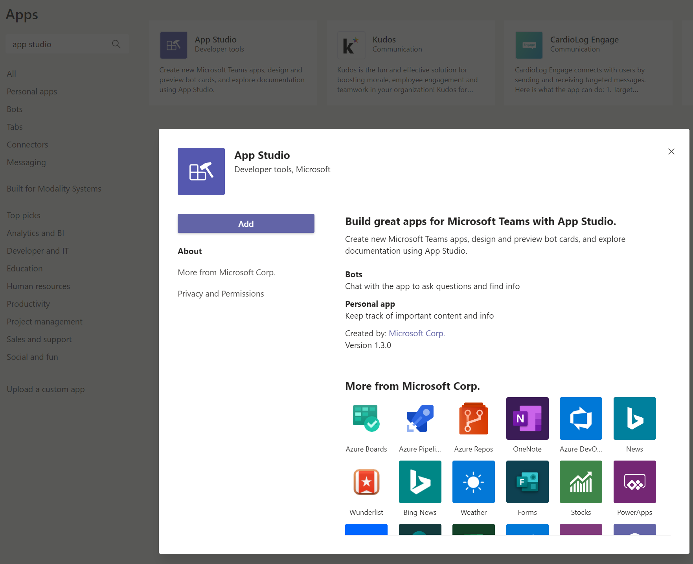
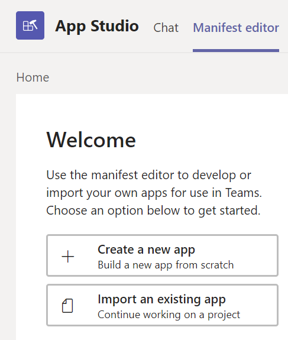

## Creating your manifest file

You must install the "App Studio" application on your local teams client, load in the template [CreateTeam.zip]("http://docs.modalitysoftware.com/CreateTeam/images/CreateTeam.zip") provided, update specific values and then download the new manifest, as seen below:

1. From Microsoft Teams go to the Apps section

2. Search for "App Studio" and install by selecting "Add"

3. Open "App Studio", then select the "Manifest editor" tab and then click "Import an existing app"

4. Browse to the directory that contains the "CreateTeam Template.zip" provided, select this file and click "Ok"

5. The base template will now be visible within the manifest editor tab, simply highlight select the elipsis and click "Edit"

6. Select "Tabs" within the "Capabilities" section, then click "Add" underneath the "Add a personal tab" section.

7. Fill in the fields using the values below and select "Save":

   1. Name = Main
   2. Entity ID = ctID
   3. Content URL = **output from the ARM template**

8. Select "Domains and permissions" within the "Finish" section, enter in your valid domain which was also **output from the ARM template** and then select "Add"

9. Select "Test and distribute" within the "Finish" section and then select "Download"

10. Your new template with the correct values will now be located in your default download directory. The file will be called "CreateTeam.zip", this is your final template that will be used when installing.

Now you have a correctly configured manifest file for your tenant, it is ready to be installed onto your Teams tenant. Follow the steps in the [installation section](manifestInstall.md).
