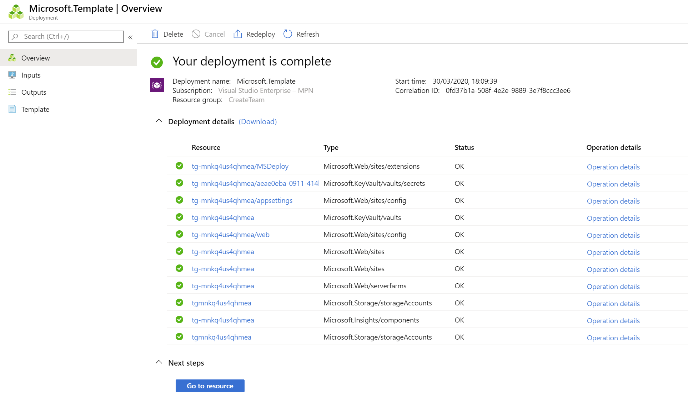
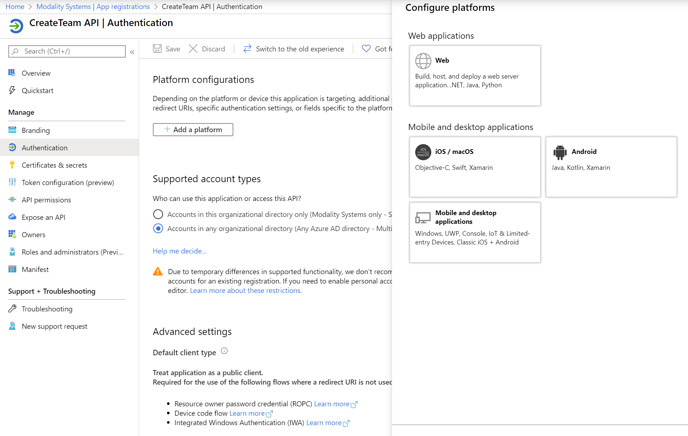
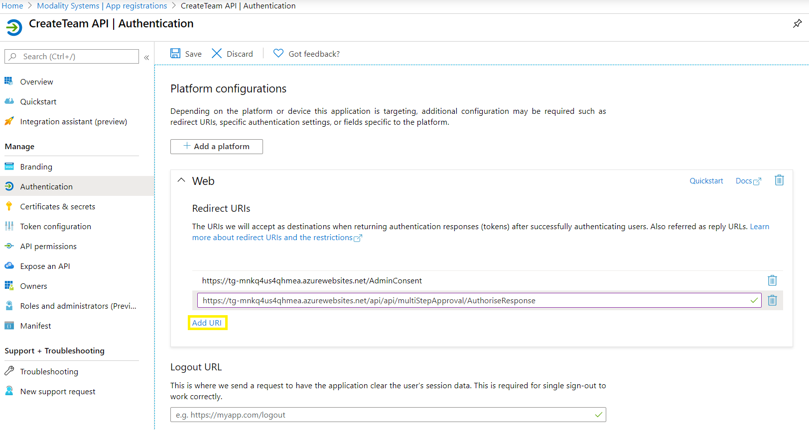
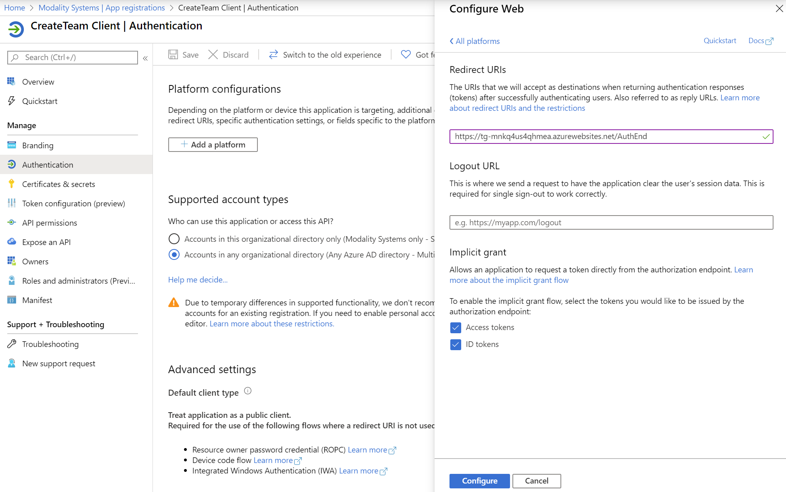
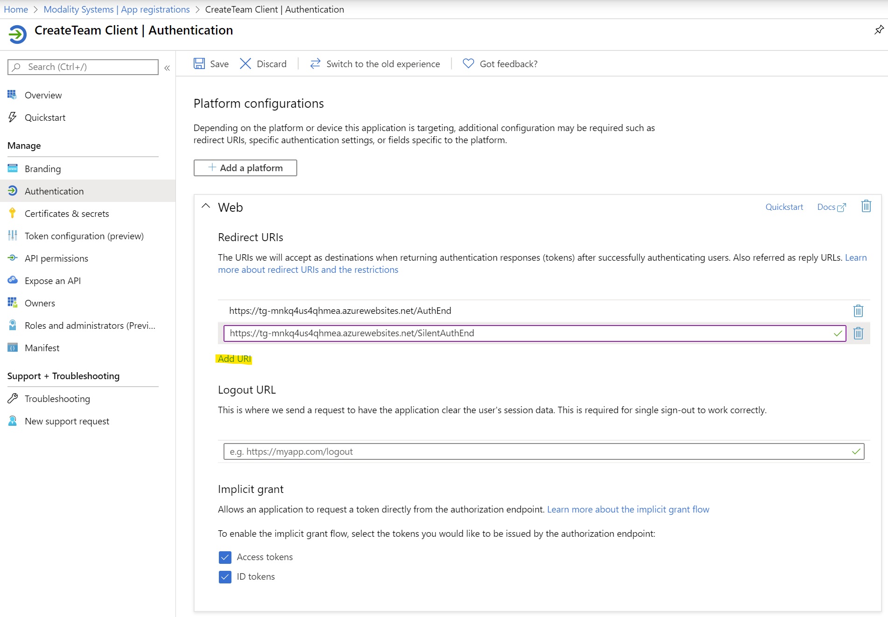

# CreateTeam ARM Deployment

CreateTeam can be provided as an Azure Resource Manager (ARM) template that automatically provisions and starts the required resources in your Azure subscription.

> Note: You must have [registered an application](RegisterApplicationAPI.md) beforehand.

> Note: For an introduction to Azure Resource Manager see [docs.microsoft.com](https://docs.microsoft.com/en-us/azure/azure-resource-manager/resource-group-overview).

This ARM Template will install resources in your Azure tenant. The template will deploy the following resources:

| Service Type         | Description                                                                                            |
| -------------------- | ------------------------------------------------------------------------------------------------------ |
| Web App Service      | S1, 100 Total ACU, 1.75GB memory, A-Series Compute Equivalent                                          |
| Key Vault            | Securely stores Web App Secret                                                                         |
| Storage Accounts     | Block Blob Storage, General Purpose V2, RA-GRS Redundancy, 1,000 GB Capacity, 100 Storage transactions |
| Azure SQL Database   | Single Database, DTU purchase model, Standard tier, S0: 10 DTUs, 250 GB included storage per DB        |
| [Application Insights] | [Logs for Web App Bot and Web App Service] Not installed by default*                                 |

> Important: **Remote Application Logging. By default the application will configure itself to send logging and telemetry data to Modality Systems using an Application Insights instance securely hosted in Microsoft Azure. This enables Modality Systems to investigate and remediate any reported issues remotely. By exception it may be possible instead to keep logging data within the customer's tenant but this may have licensing and support implications which you should discuss with Modality Systems to fully understand.**

## Installation

1. Click on the ARM template link that was provided by us. You will be taken to Microsoft Azure Portal and a deployment form will open as shown below.

   

2. Carefully fill in the fields. In some cases the tooltips may provide extra guidance.

   - Basics
     - **Subscription** - Choose the Azure subscription to which deployed resources will be billed.
     - **Resource group** - It is strongly recommended that you create a new resource group for logical grouping and management of CreateTeam. _When applying an upgrade choose the Resource Group that already contains CreateTeam._
     - **Location** - The location of the newly created resource group (this only determines the geographical location of resource group and its metadata, to change the location of the resources themselves, see _Location_ below).
   - Settings
     - **Azure Application details** - Use the details you generated when [registering an application](RegisterApplicationAPI.md).
     (Use API Client ID as *API Id*, API Secret as *App Secret* and Client Application Id as *Client Id*)
     - **Slot Name** - Name of the slot or environment to deploy. Should make it easy to identify company and must be between 2 and 7 letters only
     - **SQL Password** - The desired password credential for administrative access to the SQL Database
     - **Send Grid API Key and Template IDs** - Use the details you generated when [configuring SendGrid Email Delivery Service](sendGrid.md) within your tenant
     - **Send Grid From Email address and Name** - The name and email address that CreateTeam emails will come from
     - **Valid Tenant IDs** - This should be in the format https://sts.windows.net/{TENANTID}/
     - **Logs To Modality** - Defaults to Yes will send logging information to Modality for better troubleshooting
     - **Storage Name** - It is strongly advised to leave this as default which will create a storage account starting tg followed by a unique string.
     - **Resource Tags** - Tags that will be applied to all deployed components. If changing ensure format is maintained
     - **Deploy Logos** - Leave this as No
     - **Upgrade** - Deploy CreateTeam to an upgrade slot that can then be swapped later to minimize application downtime

3. Read the Terms and Conditions, then click "I agree to the terms and conditions stated above" and click "Purchase" (this refers to the resources hosted on Azure, and is not a usage agreement for CreateTeam.)

4. The notification bell will show the deployment in progress, the when complete click Go to resource group

   

   * By clicking on Deployment in progress you will be able to see what it is actually doing.

5. After a period of deployment should get a Resource group in your tenant with the following components

   

6. On the left hand menu, click Deployments and then the name of the Deployment that just completed

   

7. Under Deployment details you should see a green tick next to each deployed item to indicate that it was successfully deployed

   

   >NOTE On occasion the final step to deploy the CreateTeam Application Code may fail. If this happens use the **Redeploy** button and choose the same Resource Group and Parameters as chosen above
   

8. On the left hand menu click Outputs. Then use the "Copy to Clipboard" button next to each value, open Windows Notepad and paste each value with appropriate title.

   

   >NOTE The Admin Consent URL is useful for instances when the person following this guide **DOES NOT** have Global Admin Privileges. Forward this URL on to someone who does so that they can grant consent for the tenant.

9. Using same tenant that was used to create API and Client App registrations , 
   go to Azure Active Directory -> App registrations -> CreateTeam API -> Authentication and click Add a Platform, then click Web

   

10. Under Redirect URI enter the value that you obtained from Outputs section of the ARM deployment for appAdminConsent.
   * Click Configure

   

 11. Under Web -> Redirect URIs, click "Add URI" and enter the value that you obtained from Outputs section of the ARM deployment for for appMultiStepAuth.
   * Click Configure

   

12. Now goto Azure Active Directory -> App registrations -> CreateTeam Client -> Authentication and click Add a Platform, then click Web

   

13. Under Redirect URI enter the value that you obtained from Outputs section of the ARM deployment for appAuthEnd
   * Tick Access tokens and ID tokens and click Configure

   

14. Under Web -> Redirect URIs, click "Add URI" and enter the value that you obtained from Outputs section of the ARM deployment for appSilentAuthEnd
  * Click Save

   

## Upload your company logo to CreateTeam

1. Optionally you may want your company logo to appear within CreateTeam
   - Please follow steps [Upload your company logo to CreateTeam](uploadLogoToWebApp.md) for instructions.

## Certificates in Azure for authentication

1. A certificate is used for CreateTeam to make secure graph calls
   - Please follow steps [Generating and uploading certificates in Azure for authentication](certificateGeneration.md) for next steps.