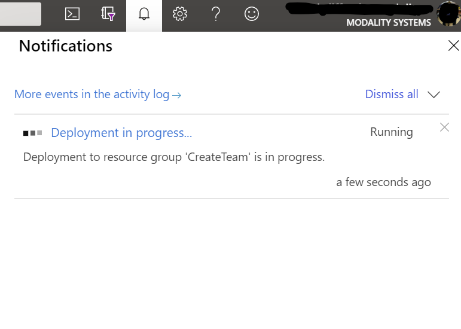
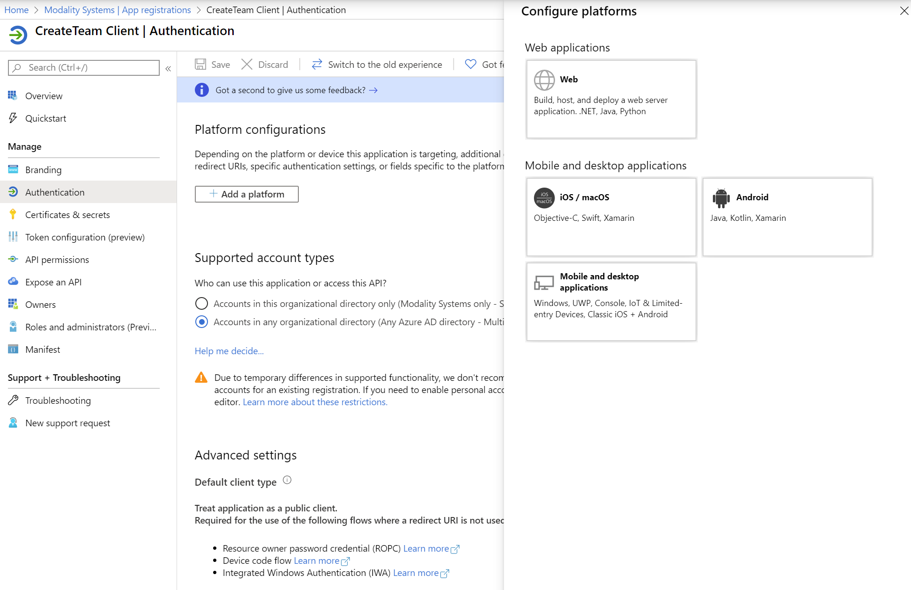

# CreateTeam ARM Deployment

CreateTeam can be provided as an Azure Resource Manager (ARM) template that automatically provisions and starts the required resources in your Azure subscription.

- Contact info@modalitysystems.com for a URL to the ARM Deployment.

> Note: You must have [registered an application](RegisterApplicationAPI.md) beforehand.

> Note: For an introduction to Azure Resource Manager see [docs.microsoft.com](https://docs.microsoft.com/en-us/azure/azure-resource-manager/resource-group-overview).

This ARM Template will install resources in your Azure tenant. The template will deploy the following resources:

| Service Type         | Description                                                                                            |
| -------------------- | ------------------------------------------------------------------------------------------------------ |
| Web App Service      | S1, 100 Total ACU, 1.75GB memory, A-Series Compute Equivalant                                          |
| Key Vault            | Securely stores Web App Secret                                                                         |
| Application Insights | Logs for Web App Bot and Web App Service                                                               |
| Storage Accounts     | Block Blob Storage, General Purpose V2, RA-GRS Redundancy, 1,000 GB Capacity, 100 Storage transactions |

## Installation

1. Click on the ARM template link that was provided by us. You will be taken to Microsoft Azure Portal and a deployment form will open as shown below.

   

1. Carefully fill in the fields. In some cases the tooltips may provide extra guidance.

   - Basics
     - **Subscription** - Choose the Azure subscription to which deployed resources will be billed.
     - **Resource group** - It is strongly recommended that you create a new resource group for logical grouping and management of CreatTeam. _When applying an upgrade choose the Resource Group that already contains CreateTeam._
     - **Location** - The location of the newly created resource group (this only determines the geographical location of resource group and its metadata, to change the location of the resources themselves, see _Location_ below).
   - Settings
     - **Azure Application details** - Use the details you generated when [registering an application](RegisterApplicationAPI.md).
     - **Send Grid Config Details** - These are settings required for SendGrid to send emails
     - **Valid Tenant IDs** - This should be in the format https://sts.windows.net/{TENANTID}/
     - **Storage Name** - It is strongly advised to leave this as default which will create a storage account starting tg followed by a unique string.

1. Read the Terms and Conditions, then click "I agree to the terms and conditions stated above" and click "Purchase" (this refers to the resources hosted on Azure, and is not a usage agreement for CreateTeam.)

1. The notification bell will show the deployment in progress, the when complete click Go to resource group

   

   * By clicking on Deployment in progress you will be able to see what it is actually doing.

1. After a period of deployment should get a Resource group in your tenant with the following components

   

1. On the left hand menu, click Deployments and then the name of the Deployment that just completed

   

1. Under Deployment details you should see a green tick next to each deployed item to indicate that it was successfuly deployed

   

1. On the left hand menu click Outputs. Then use the "Copy to Clipboard" button next to each value, open Windows Notepad and paste each value with appropriate title.

   

1. Now go back to Azure Acive Directory -> App registrations -> CreateTeam API -> Authentication and click Add a Platform, then click Web

   

1. Under Redirect URI enter the value that you obtained from Outputs section of the ARM deployment for appAdminConsent

   

   * Click Configure

1. Now goto Azure Acive Directory -> App registrations -> CreateTeam Client -> Authentication and click Add a Platform, then click Web

   

1. Under Redirect URI enter the value that you obtained from Outputs section of the ARM deployment for appAuthEnd

   

   * Tick Access tokens and ID tokens and click Configure

1. Under Web -> Redirect URIs, click "Add URI" and enter the value that you obtained from Outputs section of the ARM deployment for appSilentAuthEnd

   

   * Click Save

## Provision CreateTeam Settings

1. The storage account that was deployed as part of the ARM Deployment requires settings to be added
   - Please follow steps [Azure Table Storage Configuration](../TableStorageConfiguration.md) and then continue to CreateTeam Manifest for ARM Deployment.

## CreateTeam Manifest for ARM Deployment

1. The backend deployment is now complete but for people to interact with CreateTeam you will need to create a manifest file and install into Microsoft Teams.
   - Please continue to [CreateTeam Manifest for ARM Deployment](manifestCreate.md) for next steps.