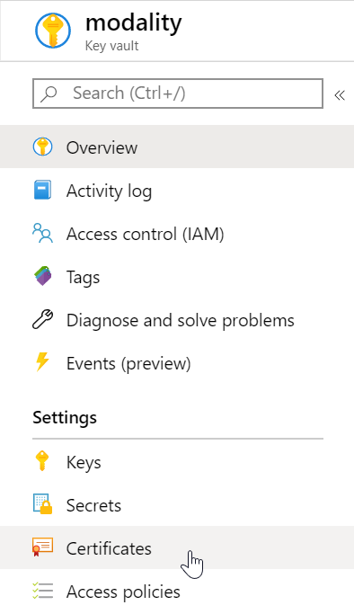
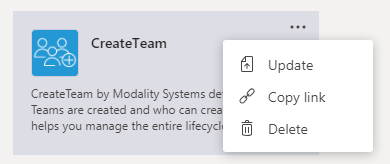

## Upload Certificate to App Registration

1. Navigate to the resource group that CreateTeam has been deployed too
   
   

1. Click on the KeyVault and then Certificates
   
   

1. Click on the Certificate called CreateTeam
   
   

1. Click on the Current version

   

1. Then on the certificate details screen, there will be an option to "Download in CER format", select this and keep track of the directory it downloads to, which should be your default browser download directory.

   

Following the section above, you should have a valid certificate which will now be used to upload against the app registration. So the next step is go to the app registration and follow the steps below:

1. When the app registration has loaded, go to the "certificates & secrets" section and select the "Upload certificate" button underneath the "Certificates" header

   

1. Browse to the directory containing the .cer certificate file recently created, and select "Ok". The import should work and you upload should show against the app registration

   

It is unlikely that you have uploaded the wrong certificate, but you can verify by checking that the "Thumbprint" values matches on both the uploaded certificate and the one created in KeyVault.

## Upload CreateTeam manifest to Microsoft Teams

Using the manifest file that was created by **PostARMDeployScript.ps1**, follow the instructions below:

1. From Microsoft Teams go to the Apps section

   

1. Then select Upload for [YOUR ORGANISATION NAME]

   

1. Then select the zip file downloaded as detailed in the previous section.

   

1. The App should then appear within your companies Apps section

   

> NOTE: To update an App that has already been installed, navigate to the App within your companies Apps section then hover your mouse pointer over the app, click on the ... in the top right corner and click Update

## Allow App to be installed within Microsoft Teams

Now that the App has been added to your Microsoft Teams Tenant, your Global policy may need to be adjusted to allow it to be installed by users.

1. From the Microsoft Teams Admin Center https://admin.teams.microsoft.com/ , under _Teams apps_ click _Permission policies_

   

1. Click on _Global (Org-wide default)_ (or whatever policy is applied to your organisation)

   

1. Make sure the _Tenant apps_ policy is set to Allow all apps

   

> NOTE: You could also specify a list of allowed apps here

## Pin App within Microsoft Teams

> NOTE: You can call the policy whatever you like, it is not required to be called "CreateTeam-ModProd" as seen in the pictures below.

To improve the end user experience it is recommended to pin the App to the main Microsoft Teams list of Apps

1. From the Microsoft Teams Admin Center, under _Teams apps_ click _Setup policies_

   

1. Either edit _Global (Org-wide default)_ or create a new policy and give it a name

   

1. Click _Add apps_, select _Permissions policy_ from previous step, search for TG and click Add

   

1. Click Save

   

If you created a new Setup policy in step 2 then you will need to assign users to the policy

1. From the Microsoft Teams Admin Center, under _Teams apps_ click _Setup policies_, click on the tick next to the required policy name

   

1. Click _Manage users_ and add the required users

   

Further information about managing app setup policies in Microsoft Teams is available:

[Manage app setup policies in Microsoft Teams](https://docs.microsoft.com/en-us/microsoftteams/teams-app-setup-policies)

> NOTE A user can only be assigned to 1 app settings policy so this will remove them from the policy that they are currenlty assigned too

## User Consent for CreateTeam App Client

When a user first launches the App from within Microsoft Team, they are required to provide consent for their details to be accessed by the App

## Changing default settings

This application looks at your default tenant settings to determine the default value of certain fields.
To change your default tenant settings read the following guide.
https://docs.microsoft.com/en-us/graph/api/resources/groupsetting?view=graph-rest-1.0

The following fields look at tenant default values

1. External Checkbox looks at AllowToAddGuests value

# Azure Table Storage Configuration

1. Open Azure Storage explorer on your PC (Download from https://azure.microsoft.com/en-us/features/storage-explorer/) add your PROD account and subscription if required

1. Open the storage account associated with Create Team

1. Add/Edit rows individualy, or [import the default values into table storage](ImportDefaultValuesTableStorage.md)

## Feature Table

> Default Values can be downloaded from here: [Feature.typed.csv](../images/customerHosted/Feature.typed.csv)

Add a Feature for each of the following RowKeys:

- PartitionKey = [TenantId]
  > Note: See [whatsmytenantid.com](https://www.whatismytenantid.com/) to help find this
- RowKey = This is a unique string to identify the feature.
  - clone-teams
  - control-guest-access
  - custom-teams
  - enable-logo
  - hide-pii (Personally Identifiable Information)
  - multi-step-approval
- Enabled (boolean) = whether to enable the feature or not

> The _enable-logo_ field should only be set to _true_ after [a logo has been uploaded to your Web App Service](uploadLogoToWebApp.md).

## PeoplePicker Table

> Default Values can be downloaded from here: [PeoplePicker.typed.csv](../images/customerHosted/PeoplePicker.typed.csv)

Add a PeoplePicker for each of the following RowKeys:

- ParitionKey = [TenantId]
- RowKey = This is a unique string to identifiy the People Picker.
  - members
  - owners
  - guests
- NativeMinCount (Int32) = The minium count of people. If this number is not met, the field will invalidate the form and advise of the minimum count (red)

> For the 'owners' field, the minimum value of NativeMinCount is 1. For the other PeoplePicker fields, 'members' and 'guests', the minimum value of NativeMinCount is 0.

- RecommendedMinCount (Int32) = The recommended minimum count of people. If this number is not met, the field will advise of the recommended minimum count (yellow)
- RecommendedMaxCount (Int32) = The recommended maximum count of people. If this number is exceeded, the field will advise of the recommended maximum count (yellow)
- NativeMaxCount (Int32) = The maximum count of people. If this number is exceeded, the field will invalidate the form and advise of the maximum count (red)

> For the 'members' and 'guests' fields, the maximum value of each individual NativeMaxCount is 5000. However the combined maximum is also 5000. For example if 'members' has a value of 3000, then the maximum for 'guests' is 2000. (3000 + 2000 = 5000)

> For the 'owners' field, the maximum value of NativeMaxCount is 100.

- Validate (boolean) = This will enabled or disable the above validation rules for the People Picker.

> Please note, NativeMinCount <= RecommendedMinCount <= RecommendedMaxCount <= NativeMaxCount

> It's advisable to stick to the default native min and max counts, or, ensure the new values are more strict than the defaults. These match native teams validation.

## TextField Table

> Default Values can be downloaded from here: [TextField.typed.csv](../images/customerHosted/TextField.typed.csv)

Add a TextField for each of the following RowKeys:

- ParitionKey = [TenantId]
- RowKey = This is a unique string to identifiy the Text Field.
  - description
  - name
- NativeMinLength (Int32) = The minium length of input. If this number is not met, the field will invalidate the form and advise of the minimum length (red)

> For the 'name' field, the minimum value of NativeMinLength is 1.

> For the 'description' field, the minimum value of NativeMinLength is 0.

- RecommendedMinLength (Int32) = The recommended minimum length of input. If this number is not met, the field will advise of the recommended minimum length (yellow)
- RecommendedMaxLength (Int32) = The recommended maximum length of input. If this number is exceeded, the field will advise of the recommended maximum length (yellow)
- NativeMaxLength (Int32) = The maximum length of input. If this number is exceeded, the field will invalidate the form and advise of the maximum length (red).

> For the 'name' field, the maximum value of NativeMaxLength is 245. If you have suffixes defined in the Template table, see below. The NativeMaxLength for the 'name' field must be less than the maximum length (245) minus the length of the longest suffix. For example a suffix with the maximum length of 10 would require a 'name' NativeMaxLength of less than 235 (245 - 10).

> For the 'description' field, the maximum value of NativeMaxLength is 1025.

- Validate (boolean) = This will enabled or disable the above validation rules for the Text Field.

> Please note, NativeMinLength <= RecommendedMinLength <= RecommendedMaxLength <= NativeMaxLength

> It's advisable to stick to the default native min and max lengths, or, ensure the new values are more strict than the defaults. These match native teams validation.

## Approvers Table

> Default Values can be downloaded from here: [Approvers.typed.csv](../images/customerHosted/Approvers.typed.csv)

If the multi-step-approval feature is enabled, the email address within this table for the tenant will be sent an email when approval is required. (This is when a user creates a team that does not meet recommended validation as per the TextField and PeoplePicker tables)

- ParitionKey = [TenantId]
- RowKey = The email address of the approver
- DisplayName = The display name of the approver. (this is only used inside table storage as a reference and is not used within the system)

## Emails Table

Ignore, this is a reserved system table and not for configuration

## Template Table

> Default Values can be downloaded from here: [Template.typed.csv](../images/customerHosted/Template.typed.csv)

The templates defined in this table will appear as templates in the main menu for the tenant.

- PartitionKey = [TenantId]
- RowKey = This should be a unique Guid. To generate a Guid visit https://www.guidgenerator.com/, press the “Generate some GUIDs!” button and copy the result into this field. A new Guid needs generating for each row.
- Description = This text will appear in the summary box on the create team form when the template is selected
- Name = The name will appear in the template drop down on the main menu
- TemplateJson = The definition of the template to be created. [Learn how to configure the template JSON.](templateJsonConfiguration.md)