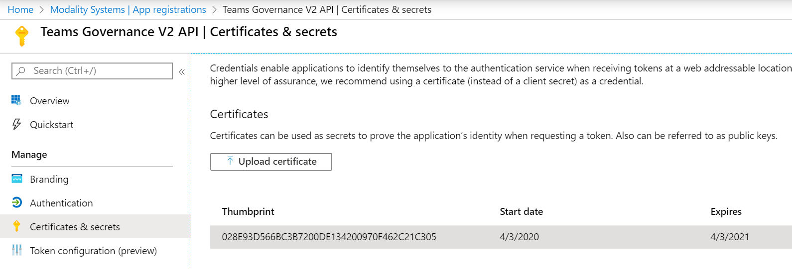

# Provisioning and setting up certificates

CreateTeam consumes two different apis, Microsoft Graph and SharePoint. In order to consume these, certificates are required to be generated, which CreateTeam will use to authorise the api made to each.

## Generating certificates

To generate a self-signed certificate within Azure you need to go to your KeyVault resource within azure DevOps, then go through the following steps:

1. Select  "Certificates" under the "Settings" section

   

1. Fill in the form with the following values, then select "Create":
   1. Method of Certificate Creation - "**Generate**" - *select from dropdown*
   1. Certificate Name - "**CreateTeam**" - *ensure this exactly matches*
   1. Type of Certificate Authority (CA) - **Self-signed certificate**
   1. Subject - "**CN=yourdomain.com**"
   1. DNS Names - **0** - *keep empty*
   1. Valditiy Period (in months) - **12** - *this process is required every 12 months*
   1. Content Type - **PKCS #12**
   1. Lifetime Action Type - **E-mail all contacts at a given numbers of days before expiry** - *you have to specify these emails, but do not bother*
   1. Numbers of Days before Expiry - **30** - *as mentioned above, irrelevant*
   1. Advanced Policy Configuration - **Not configured**

   

   > Note: If you would like to add email addresses for expirty notifications, then you can do so by "Certificate Contacts" and adding in email addresses.

   

1. Once created, the certificate will provision for a few seconds and then display. Once displayed, click on the certificate.

   

1. Click on the certificate again on the next page.

   

1. Then on the certificate details screen, there will be an option to "Download in CER format", select this and keep track of the directory it downloads to, which should be your default browser download directory.

   

## Upload certificate to app registration

Following the section above, you should now have a valid certificate which will now be used to upload against the app registration. So the next step is go to the app registration and follow the steps below:

1. When the app registration has loaded, go to the "certificates & secrets" section and select the "Upload certificate" button underneath the "Certificates" header

   

2. Browse to the directory containing the .cer certificate file recently created, and select "Ok". The import should work and you upload should show against the app registration

   

It is unlikely that you have uploaded the wrong certificate, but you can verify by checking that the "Thumbprint" values matches on both the uploaded certificate and the one created in KeyVault.