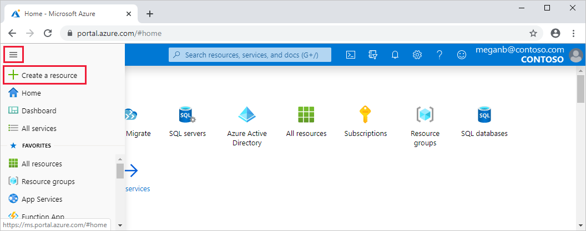
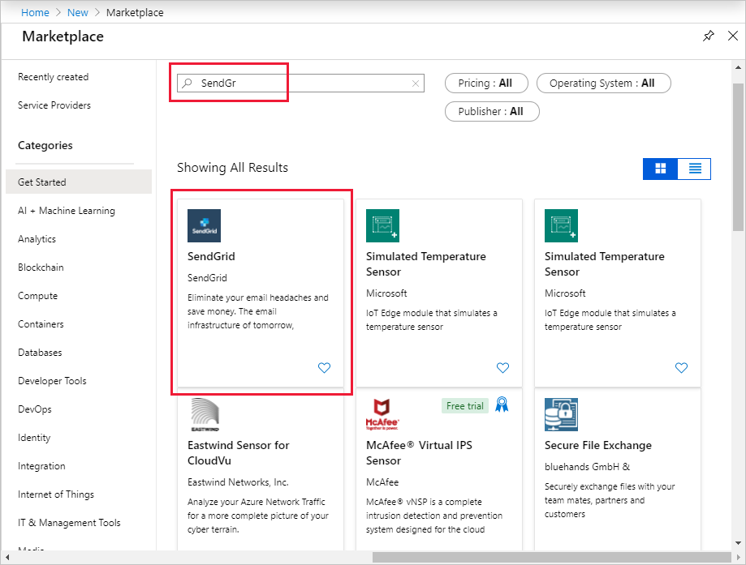
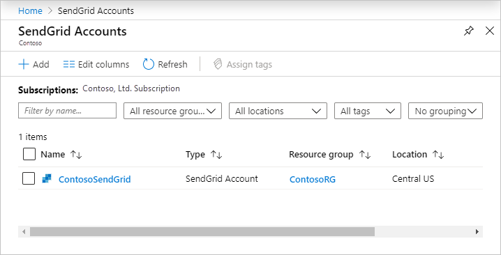
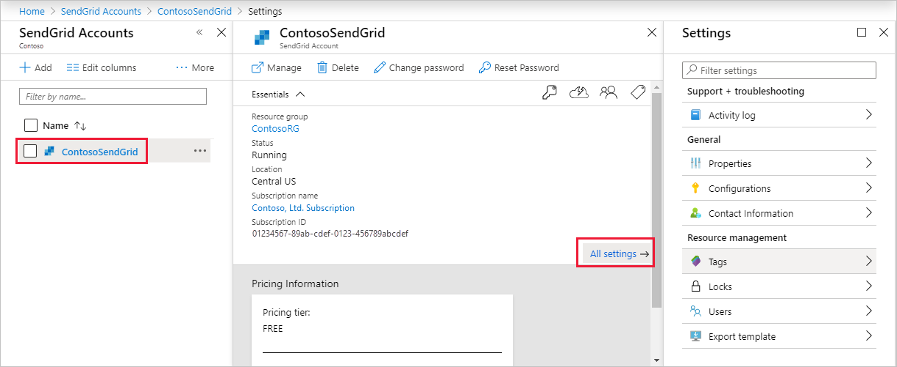

# How to Send Email Using SendGrid with Azure

SendGrid is a cloud-based email service that provides reliable transactional email delivery, scalability, and real-time analytics along with flexible APIs that make custom integration easy. Common SendGrid use cases include:

- Automatically sending receipts or purchase confirmations to customers.
- Administering distribution lists for sending customers monthly fliers and promotions.
- Collecting real-time metrics for things like blocked email and customer engagement.
- Forwarding customer inquiries.
- Processing incoming emails.
  
For more information, visit https://sendgrid.com.

# Create a SendGrid Account

Azure customers can unlock 25,000 free emails each month. These 25,000 free monthly emails will give you access to advanced reporting and analytics and all APIs (Web, SMTP, Event, Parse, and more). For information about additional services provided by SendGrid, visit the [SendGrid Solutions](https://sendgrid.com/solutions) page.

# To sign up for a SendGrid account

1.  Sign in to the [Azure portal](https://portal.azure.com).

1. In the Azure portal menu or the home page, select **Create a resource**.
   
   

1. Search for and select **SendGrid**.

   

1. Complete the signup form and select **Create**.

   

1. Enter a **Name** to identify your SendGrid service in your Azure settings. Names must be between 1 and 100 characters in length and contain only alphanumeric characters, dashes, dots, and underscores. The name must be unique in your list of subscribed Azure Store Items.

1. Enter and confirm your **Password**.

1. Choose your **Subscription**.

1. Create a new **Resource group** or use an existing one.

1. In the **Pricing tier** section select the SendGrid plan you want to sign up for.

   

1. Enter a **Promotion Code** if you have one.

1. Enter your **Contact Information**.

1. Review and accept the **Legal terms**.

1. After confirming your purchase you will see a **Deployment Succeeded** pop-up and you will see your account listed.

   

After you have completed your purchase and clicked the Manage button to initiate the email verification process, you will receive an email from SendGrid asking you to verify your account. If you do not receive this email, or have problems verifying your account, please see our FAQ.

   

**You can only send up to 100 emails/day until you have verified your account.**

To modify your subscription plan or see the SendGrid contact settings, click the name of your SendGrid service to open the SendGrid Marketplace dashboard.

   

To send an email using SendGrid, you must supply your API Key.

# To find your SendGrid API Key

1. Click Manage.

   

1. In your SendGrid dashboard, select **Settings** and then **API Keys** in the menu on the left.

   

1. Click the **Create API Key**.

   

1. At a minimum, provide the **Name of this key** and provide full access to **Mail Send** and select **Save**.

   

1. Your API will be displayed at this point one time. Please be sure to store it safely.

# To find your SendGrid credentials

1. Click the key icon to find your **Username**.

  

1. The password is the one you chose at setup. You can select Change password or Reset password to make any changes.

To manage your email deliverability settings, click the Manage button. This will redirect to your SendGrid dashboard.

  

  For more information on sending email through SendGrid from a custom domain, visit the [How to set up domain authentication](https://sendgrid.com/docs/ui/account-and-settings/how-to-set-up-domain-authentication) guide.