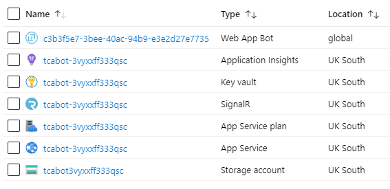

# Teams Chat Assist ARM Deployment

Teams Chat Assist Bot can be provided as an Azure Resource Manager (ARM) template that automatically provisions and starts the required resources in your Azure subscription.

- Contact info@modalitysystems.com for a URL to the ARM Deployment.

> Note: You must have [registered an application](registerapplication.md) beforehand.

> Note: For an introduction to Azure Resource Manager see [docs.microsoft.com](https://docs.microsoft.com/en-us/azure/azure-resource-manager/resource-group-overview).

This ARM Template will install resources in your Azure tenant. The template will deploy the following resources:

| Service Type  | Description   |
| ------------- | ------------- |
| Web App Bot  | S1 Standard |
| Web App Service  | S1, 100 Total ACU, 1.75GB memory, A-Series Compute Equivalant  |
| SignalR Service  | 1 Unit, 1K Connections, 1M Messages per day  |
| Application Insights  | Logs for Web App Bot and Web App Service |
| Storage Accounts  | Block Blob Storage, General Purpose V2, RA-GRS Redundancy, 1,000 GB Capacity, 100 Storage transactions |

## Installation

1. Click on the ARM template link that was provided by us. You will be taken to Microsoft Azure Portal and a deployment form will open as shown below.

   

1. Carefully fill in the fields. In some cases the tooltips may provide extra guidance. 
   - Basics
     - **Subscription** - Choose the Azure subscription to which deployed resources will be billed.
     - **Resource group** - It is strongly recommended that you create a new resource group for logical grouping and management of Teams Chat Assist. *When applying an upgrade choose the Resource Group that already contains Teams Chat Assist.*
     - **Location** - The location of the newly created resource group (this only determines the geographical location of resource group and its metadata, to change the location of the resources themselves, see *Location* below).
   - Settings
     - **Azure Application details** - Use the details you generated when [registering an application](applicationRegistration.md).
     - **Name** - This is the name used for all components that get deployed and must be globally unique. **The name of your company would be a good choice** and will be apended with 'tcabot-'
     - **Display Name** - This is the name of the Bot that your users will see
     - **Location** - The geographical location of the Azure resources that will host Teams Chat Assist. By default this field uses `[resourceGroup().location]`, which gets automatically replaced with location of the chosen Resource Group. Optionally you can delete this and enter the name of a different location.
       > Note: Do not include the region prefix in brackets, e.g. use "Central US" rather than "(US) Central US".

1. Read the Terms and Conditions, then click "I agree to the terms and conditions stated above" and click "Purchase" (this refers to the resources hosted on Azure, and is not a usage agreement for Teams Chat Assist.)

1. After a period of deployment should get a Resource group in your tenant with the following componants

   

1. The next step is to provision settings for your tenant in the storage account. The easiest way to do this is using the [Azure Storage Explorer](https://azure.microsoft.com/en-us/features/storage-explorer/)

   > If your company uses AD FS then you might have trouble signing into Azure Storage Explorer so try:
      - On the left vertical tool bar, open Settings. In the Settings Panel, go to Application > Sign in. Enable Use device code flow sign-in.
      - Open the Connect dialog box (either through the plug icon on the left-side vertical bar or by selecting Add Account on the account panel).
      - Choose the environment you want to sign in to.
      - Select Sign In.
      - Follow the instructions on the next panel.

1. Using Azure Storage Explorer that you have just installed, connect to your Azure Tenant and locate that storage account that was created as part of the ARM Deployment

1. [Import the default values into table storage](ImportDefaultValuesTableStorage.md)

1. Use the [Teams Web App](https://teams.microsoft.com/) to create a new Team for the bot to post agent messages too
   - On the Get Windows App screen click **Use web app instead**
   
   - Create a new Team and call it something like Teams Chat Assist Agents
   - Make it Private, skip adding members for now but revisit this when the deployment has finished and add your Agents as members
   - Create a Channel for the Bot to post agent messages too. Call it something appropriate to the bot such as company name or workload description
   
   - Copy Thread ID from address bar as indicated above and paste into the ChannelConversationId property in the instance configuration table

1. [Edit the InstanceConfigurations table as desired](TableStorageConfiguration.md)
  

## Bot Manifest

1. The backend deployment is now complete but for people to interact with the Bot you will need to create a manifest file and install into Microsoft Teams.
   - Please see [Teams Chat Assist Manifest for ARM Deployment](armmanifest.md) for details.
