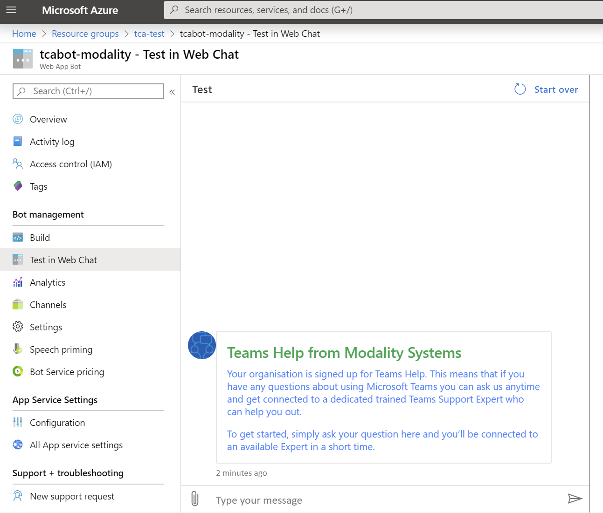

# Teams Chat Assist ARM Deployment

Teams Chat Assist Bot can be provided as an Azure Resource Manager (ARM) template that automatically provisions and starts the required resources in your Azure subscription.

- Contact info@modalitysystems.com for a URL to the ARM Deployment.

> Note: You must have [registered an application](registerapplication.md) beforehand.

> Note: For an introduction to Azure Resource Manager see [docs.microsoft.com](https://docs.microsoft.com/en-us/azure/azure-resource-manager/resource-group-overview).

This ARM Template will install resources in your Azure tenant. The template will deploy the following resources:

| Service Type  | Description   |
| ------------- | ------------- |
| Web App Bot  | S1 Standard |
| Web App Service  | S1, 100 Total ACU, 1.75GB memory, A-Series Compute Equivalant  |
| SignalR Service  | 1 Unit, 1K Connections, 1M Messages per day  |
| Application Insights  | Logs for Web App Bot and Web App Service |
| Storage Accounts  | Block Blob Storage, General Purpose V2, RA-GRS Redundancy, 1,000 GB Capacity, 100 Storage transactions |

## Installation

1. Click on the ARM template link that was provided by us. You will be taken to Microsoft Azure Portal and a deployment form will open as shown below.

   

2. Carefully fill in the fields. In some cases the tooltips may provide extra guidance. 
   - Basics
     - **Subscription** - Choose the Azure subscription to which deployed resources will be billed.
     - **Resource group** - It is strongly recommended that you create a new resource group for logical grouping and management of Teams Chat Assist. *When applying an upgrade choose the Resource Group that already contains Teams Chat Assist.*
     - **Location** - The location of the newly created resource group (this only determines the geographical location of resource group and its metadata, to change the location of the resources themselves, see *Location* below).
   - Settings
     - **Azure Application details** - Use the details you generated when [registering an application](applicationRegistration.md).
     - **Name** - This is the name used for all components that get deployed and must be globally unique. **The name of your company would be a good choice** and will be apended with 'tcabot-'
     - **Display Name** - This is the name of the Bot that your users will see
     - **Location** - The geographical location of the Azure resources that will host Teams Chat Assist. By default this field uses `[resourceGroup().location]`, which gets automatically replaced with location of the chosen Resource Group. Optionally you can delete this and enter the name of a different location.
       > Note: Do not include the region prefix in brackets, e.g. use "Central US" rather than "(US) Central US".

3. Read the Terms and Conditions, then click "I agree to the terms and conditions stated above" and click "Purchase" (this refers to the resources hosted on Azure, and is not a usage agreement for Teams Chat Assist.)

4. After a period of deployment should get a Resource group in your tenant with the following componants

   

5. The next step is to provision settings for your tenant in the storage account. The easiest way to do this is using the [Azure Storage Exlorer](https://azure.microsoft.com/en-us/features/storage-explorer/)

6. Useing Azure Storage Explorer that you have just install, connect to your Azure Tenant and locate that storage account that was created as part of the ARM Deployment

7. Create a table called InstanceConfigurations

   

7. Edit the InstanceConfigurations table as follows

   

   - **PartitionKey and RowKey** - Both of these should be set to the Tenant ID of your Company. See [whatsmytenantid.com](https://www.whatismytenantid.com/) to help find this.
   - **ChannelConversationId** - Teams Chat Assist Bot requires a Team to post messages to the agents. Once this is created if you the [Teams Web App](https://teams.microsoft.com/) and navigate o the newly created team, the CannelConversationId will be shown in the address bar.
   - **ChannelServiceUrl** - Change depanding on what region your Azure Tenant was registered in.
   - **TenantName** - Name of your Azure Tenant.

8. Test the deployment by going to the Web App Bot that is in the deployed Rocource Group and navigate to Test in Web Chat

   

   

10. The deployment is now complete but for people to interact with the Bot you will need to create a manifest file and install into Teams. Please see [Teams Chat Assist Manifest for ARM Deployment](armmanifest.md) for details.