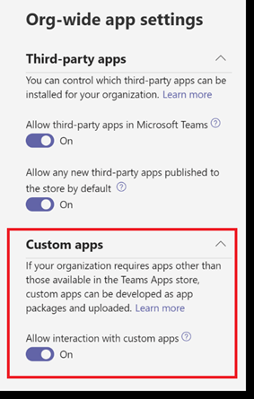
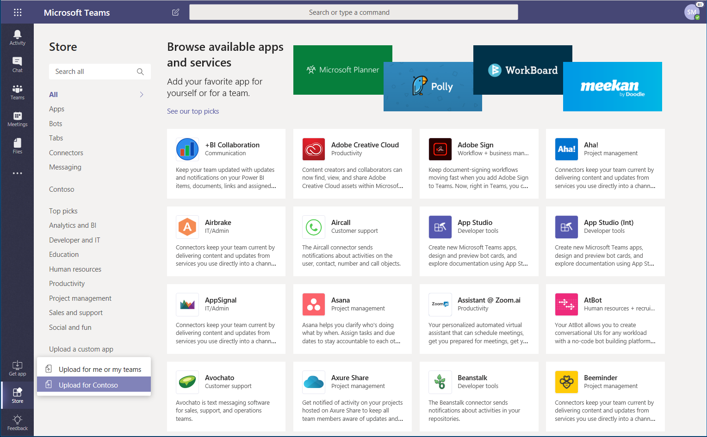
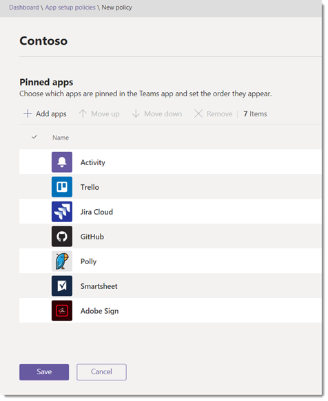

# Teams Chat Assist

> Modality Systems Teams Chat Assist offers 24/7 live chat support for your Microsoft Teams Users. Your users can talk directly with Modality Systems team of dedicated Microsoft Teams experts and ask them any question related to Teams.

Teams Chat Assist is a fully hosted Software-as-a-Service (SaaS) offering. This means that there are no servers to setup, and nothing to install. Simply add our Microsoft Teams app to your company store (instructions below) to enable your users to use Teams Chat Assist.

## Prerequisites

Before getting started with Teams Chat Assist, find and provide your Office 365 Tenant ID. Your Office 365 tenant ID is a globally unique identifier (GUID) that is different than your tenant name or domain. It's allocated to you by Microsoft and never changes.

We use your tenant ID when you use Teams Chat Assist to respond appropriately to you, ensure any SLAs are met, and monitor your usage of Teams Chat Assist.

To find your tenant ID:

**Use the Azure AD portal**

Office 365 uses Azure AD to manage user accounts. You can find your tenant ID in the Azure AD portal. You'll need to be an Azure AD administrator. To find your Office 365 tenant ID in the Azure AD portal:

 1. Log in to Microsoft Azure as an administrator.
 2. In the Microsoft Azure portal, click Azure Active Directory.
 3. Under Manage, click Properties. The tenant ID is shown in the Directory ID box.

**Use Windows PowerShell**

You can use Windows PowerShell to find the tenant ID. You'll need the [Microsoft Azure PowerShell module](https://go.microsoft.com/fwlink/p/?LinkId=717444).

Open a Microsoft Azure PowerShell command window and run the following script, entering your Office 365 credentials when prompted.

```
Login-AzureRmAccount
```

Your tenant ID is listed in the output.

Once you have your tenant ID, provide it to us before starting to use Teams Chat Assist.

# Microsoft Teams App

>This step may require a Teams Administrator to complete.

## Turn on sideloading for trusted users in production

To validate that the app is functioning correctly in your production tenant before providing to user, you’ll need to enable sideloading for yourself and/or trusted users in your org. This is done using app setup policies to do this. 

> Note: If you’re uncomfortable with using sideloading for production validation, even for yourself or trusted users, you can skip this step and follow steps 3 and 4 to upload the unvalidated app to your tenant app store, then restrict access to that app to only yourself and users you trust. These users can then get the app from the tenant app store to perform validation. After the app is validated, use the same permissions policies to open access and roll the app out for production use.

Use the [Teams admin portal](https://admin.teams.microsoft.com/) to double check that you’ve enabled the organization for custom apps. Go to **Teams apps** > **Permission policies**. Click **Org-wide app settings**. Under **Custom apps**, make sure **Allow interaction with custom apps** is turned on.



Start by navigating to **Teams apps -> Setup policies** and clicking the **Global (Org-wide default)** policy. Toggle off **Allow uploading custom apps** and click **Save**.

Now, to re-enabling sideloading for trusted users, navigate to **Teams apps -> Setup policies** and click **Add**. Give this new policy a name and description, then turn on the toggle to **Allow uploading custom apps** and click **Save**. This creates a new policy assigned to no one. To assign it to your set of trusted users, select it and click **Manage users**.


 
Search for these users, **Add** each of them, and click **Apply**. Now these users can upload the app manifest to validate that the app is properly functioning in production. 

## Upload Teams Chat Assist to the Tenant App Catalog

To make the app available to users in the tenant app store, you’ll need to upload the app. You can do this using the Teams desktop client. Follow the steps here: [docs.microsoft.com/en-us/microsoftteams/tenant-apps-catalog-teams#go-to-the-tenant-apps-catalog](https://docs.microsoft.com/en-us/microsoftteams/tenant-apps-catalog-teams#go-to-the-tenant-apps-catalog).



## Configure and Assign Permissions

### Control access to Teams Chat Assist

By default, all users will have access to this app in the Store. To restrict and control who has permission to use the app, you can create a new app permission policy. Follow the steps here: [docs.microsoft.com/en-us/microsoftteams/teams-app-permission-policies#create-a-custom-app-permission-policy](https://docs.microsoft.com/en-us/microsoftteams/teams-app-permission-policies#create-a-custom-app-permission-policy).


### Pin the app for end users to discover

By default, for users to find this app they would need to navigate to the Store and browse or search for it. To increase discovery, you can instead pre-pin the app for users in their app bar. Create a new app setup policy to accomplish that. Follow the steps here: [docs.microsoft.com/en-us/microsoftteams/teams-app-setup-policies#create-a-custom-app-setup-policyhttps://docs.microsoft.com/en-us/microsoftteams/teams-app-setup-policies#create-a-custom-app-setup-policy](https://docs.microsoft.com/en-us/microsoftteams/teams-app-setup-policies#create-a-custom-app-setup-policy).


