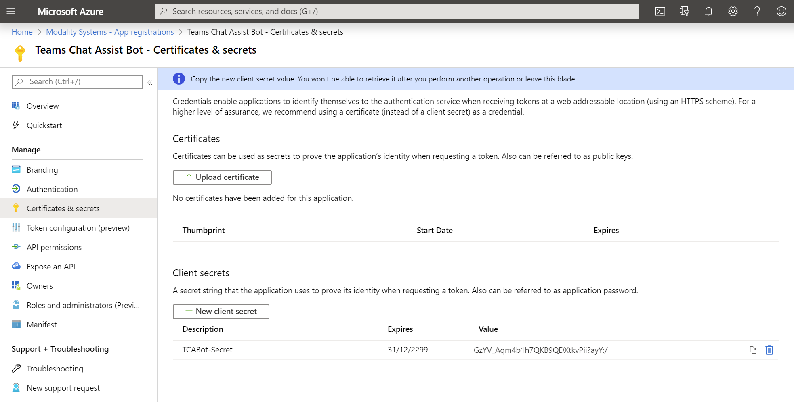

## Registering Teamwork Analytics as an Azure Application
This document describes the process of registering Teams Chat Assist Bot as an Azure Application as the first step to deployment.  As part of the registration you will gather the following information for use further along the deployment process.
   * Application ID
   * Application Secret

### Register Teamwork Analytics with Azure Active Directory
1. Sign in to the [Azure Portal](https://azure.portal.com)
1. Select the **Azure Active Directory** service from the navigation pane on the left 
1. Select **App Registrations** and click **New Registration** (Take care not to select **App Registrations (Legacy)** as these instructions do not apply to them)
1. Enter the following application registration details
   * **Name** - Recommend setting this to **Teams Chat Assist Bot**
   * **Supported Account Types** - Recommend setting this to **Accounts in this Organisational Directory Only**
   * **Redirect URI** - The authorization endpoint used by Teamwork Analytics - Recommend setting this to **https://login.live.com/oauth20_desktop.srf**
   * (The **Redirect URI Type** dropdown can be left as the default value of **Web**)
1. Click **Register** and Azure AD will create an Application ID and present the Overview page

### Add a Client Secret
1. Navigate to the **Azure Active Directory** from the navigation pane on the left
1. Select **App Registrations** and select the **Teams Chat Assist Bot** app 
1. Select **Certificates & secrets** from the Manage menu
1. Select **New client secret** and enter an appropriate description and expiry period
   * **Description** - Recommend setting this to **TCABot-Secret**
   * **Expiry** - Recommend setting this to **Never**
1. Click **Add**
1. Immediately take note of the **Secret** as this can not be retrieved later and will be required further in the deployment process

### Continue to ARM Deployment
1. Take your note of the **Application (client) ID** and **Client secrets** to the ARM Deployment phase