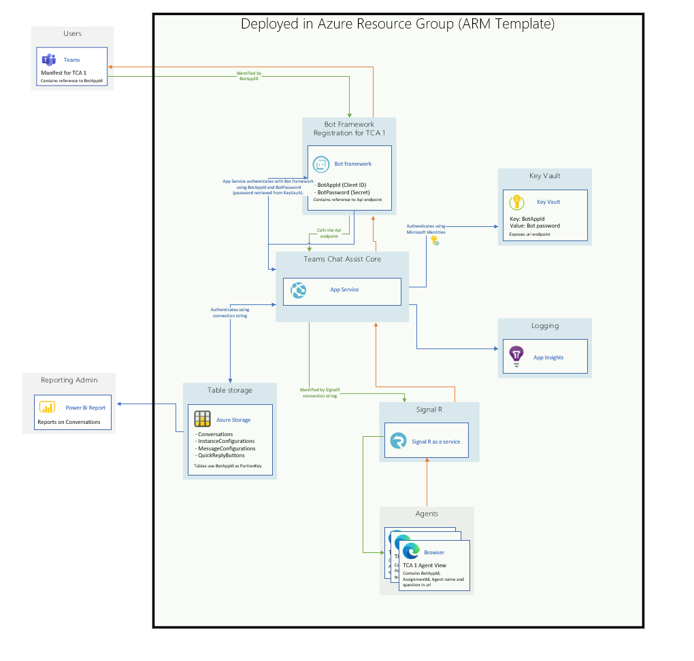

# Teams Chat Assist Security Overview

## Overview
Teams Chat Assist has been designed to be deployed into a customer's Azure tenant. This provides complete ownership and control over all parts of the solution. Teams Chat Assist uses familiar security constructs such as the Azure AD Application permission model to provide a transparaent and securable system that IT administrators have complete control over.

## Deployment & Setup
Deployment is achieved using an Azure Resource Manager (ARM) template which will automatically provision and configure a number of resouces in a specified resource group. A user with permissions to add resources to the specified resource group (and create a resource group if one does not exist) needs to deploy the ARM template.

The assets created by the ARM template do not have the ability to create more assets and have no inherant permissions to perform actions in Azure.

## Application Permission
As part of the solution deployment process, a tenant admin must approve the permissions grant of the application. This step enables administrators to review the actions which the application is asking for and ensure that they are sensible and in line with the actions that the application is performing.

Once granted to an application, the permissions persist until they are revoked. The application will be listed as an Enterprise Application in the Azure Portal. At any time an administrator can review the list of applications with permission in your Azure tenant using the Portal, and revoke if nessecary.

More detail about the permissions scopes, including an overview of available permissions and their description can be found at:
<https://msdn.microsoft.com/library/azure/ad/graph/howto/azure-ad-graph-api-permission-scopes>.

## Application Architecture
The resources deployed by the ARM template are configured to work together to deliver the Teams Chat Assist experience. They are access via a Microsoft Teams app, which is deployed separately to users.

An overview of the architecture is shown below, showing the resources deployed by the ARM template to an Azure Resource Group, and the interactions between other parts of the solution, such Microsoft Teams and PowerBI.

