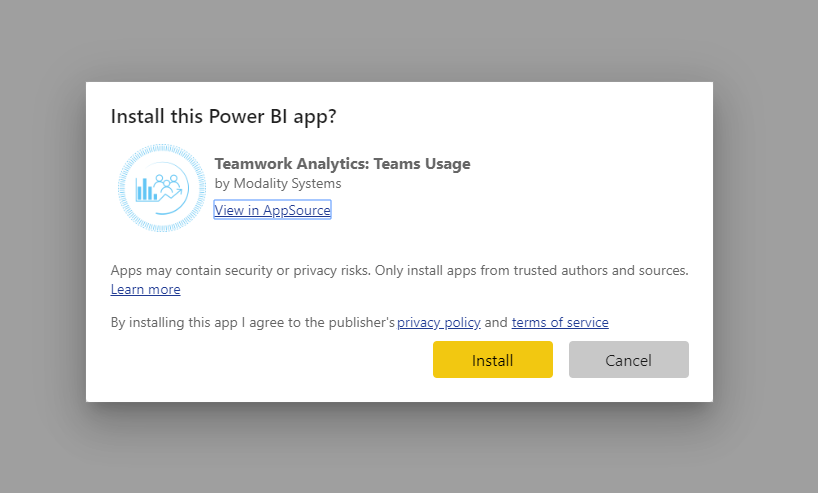
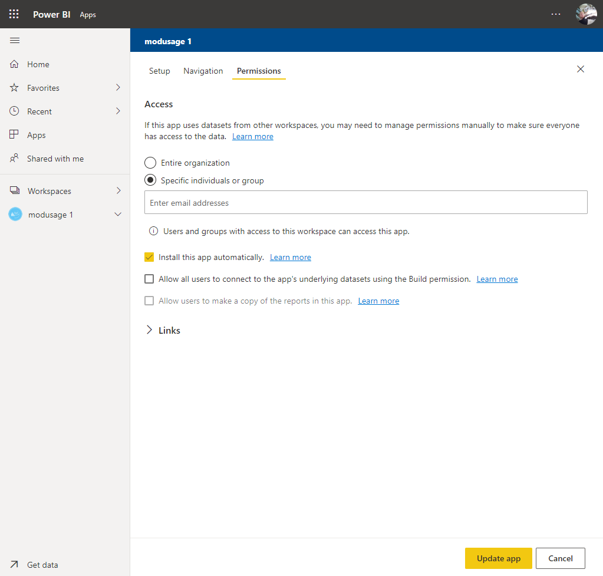
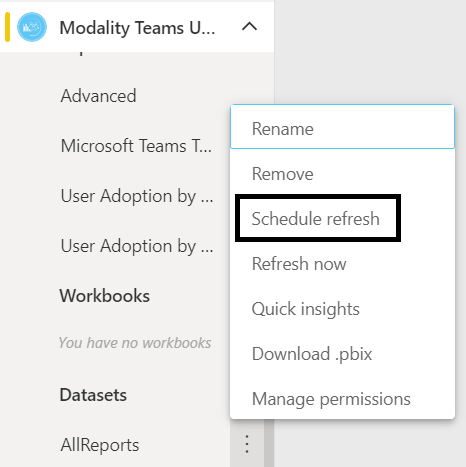
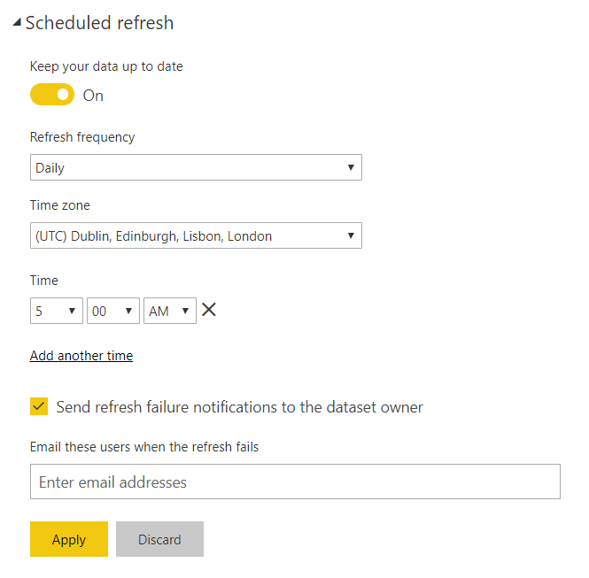

# How to Install Teamwork Analytics Reports in your Organization

The Teamwork Analytics Power BI apps are pre-made packs of reports, graphs and charts, designed to be populated with data from the Teamwork Analytics backend service. The reports are available for free from Microsoft [AppSource](https://appsource.microsoft.com/en-gb/marketplace/apps?search=Modality%20Systems%20Teamwork%20Analytics&page=1&product=power-bi). Users in your organization are required to have a [Power BI Pro license](https://docs.microsoft.com/en-us/power-bi/service-features-license-type) to view the reports.

Installing the Teamwork Analytics Power BI apps requires entering Teamwork Analytics database credentials. Although users can install the app individually, we recommend that an admin installs the app once and then publishes it within their organization. This ensures that the database credentials remain private, supports automatic installation for end users, and allows for access to be limited to specific groups and individuals (if required).
See below for step by step guides.

## Installing and publishing Power BI apps

This process involves a PowerBI Pro user performing a one-time installation of the app from AppSource, then publishing the installed app to all the desired users within their organization.

To follow these steps, you must have the Teamwork Analytics database credentials (server name, database name, username and password).

1. Find the desired app on [AppSource](https://appsource.microsoft.com/en-gb/marketplace/apps?search=Modality%20Systems%20Teamwork%20Analytics&page=1&product=power-bi) and click _Get it now_.
2.	Follow the steps in the _[Install & distribute template apps](https://docs.microsoft.com/en-gb/power-bi/service-template-apps-install-distribute#install-a-template-app)_ article on docs.microsoft.com.
  *	At the “Connect your data” stage, enter the Teamwork Analytics database credentials.
  * If you wish for end users to receive the app automatically, see the _[Enabling automatic installation for end users](#Enabling-automatic-installation-for-end-users)_ section below. Otherwise, to distribute the app, copy the installation link after submitting the Update App form, and distribute it to the desired users.
  * We recommend you add more than one administrator to the access list on the template workspace, so that the app can be updated or unpublished in the future.

## Updating Power BI apps

The process for updating an app is exactly the same as the initial installation process documented above. When installing the latest version from AppSource select "Install to a new workspace" and click _Install_.

> The "Overwrite an existing version (Preview)" option is not recommended until it becomes fully supported. 

## Enabling automatic installation for end users

During the Update App phase of installation, specify the target users in the _Access_ list or check _Entire organization_, then check _Install this app automatically_.

All users with access will receive the app automatically via the _My apps_ section on the homepage of [app.powerbi.com](https://app.powerbi.com/home) and in their [list of installed apps](https://app.powerbi.com/groups/me/apps).

The _Install this app automatically_ option must be enabled by an admin in the [admin portal](https://app.powerbi.com/admin-portal/tenantSettings) on app.powerbi.com. Look in _Tenant settings_ then _Push apps to end users_. The option can be enabled for specific security groups, allowing you to restrict it to trusted publishers, or for all users in the organization.

For more information see the _[Publish apps from workspace](https://docs.microsoft.com/en-us/power-bi/service-create-distribute-apps#automatically-install-apps-for-end-users)_ article on docs.microsoft.com.

## Configure scheduled refresh for the dataset

Navigate to the Power BI App Workspace, and click on the menu for the dataset. Select "Schedule refresh".

Under the "Schedule refresh" section, set the slider to On, and add at least one time. Click Apply to save changes.

Repeat for each app installed.

For more information see the _[Configure scheduled refresh](https://docs.microsoft.com/en-us/power-bi/refresh-scheduled-refresh)_ article on docs.microsoft.com. 