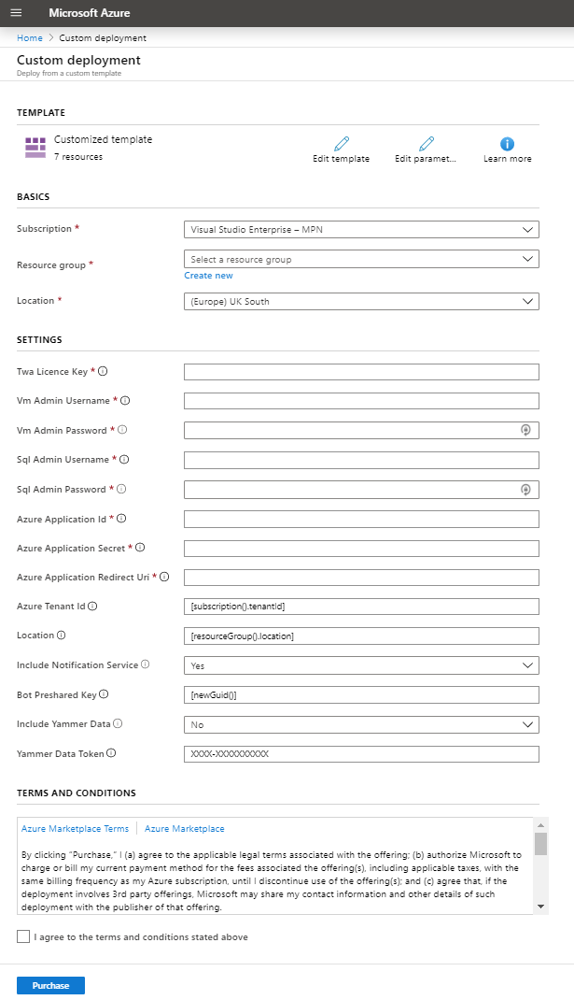
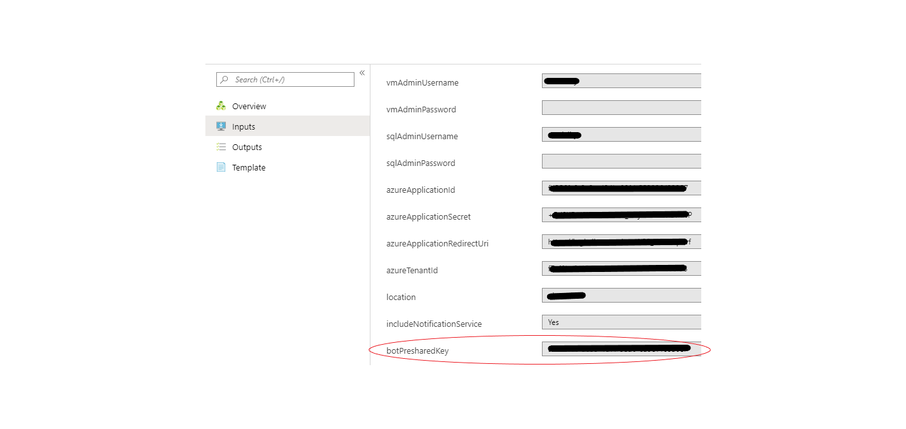
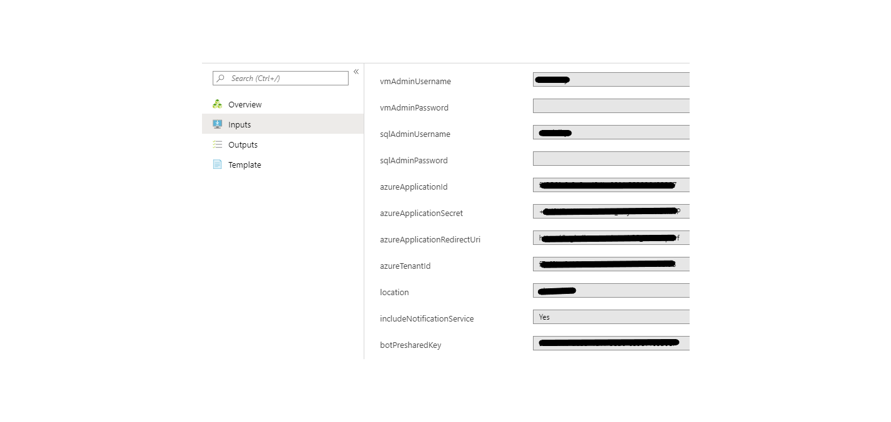

# How to deploy Teamwork Analytics

Teamwork Analytics is provided as an Azure Resource Manager (ARM) template that automatically provisions and starts the required resources in your Azure subscription.

> Note: You must have [registered an application](registerapplication.md) beforehand.

> Note: For an introduction to Azure Resource Manager see [docs.microsoft.com](https://docs.microsoft.com/en-us/azure/azure-resource-manager/resource-group-overview).

This ARM Template will install resources in your Azure tenant. The template will deploy the following resources:

| Service Type  | Description   |
| ------------- | ------------- |
| Virtual Machines  | 1 B2MS (2 vCPU(s), 8 GB RAM) x 730 Hours; Windows – (OS only); Pay as you go; 1 managed OS disks – P10 |
| Azure SQL Database  | Single Database, DTU purchase model, Standard tier, S2: 50 DTUs, 250 GB included storage per DB, 1 Database(s) x 730 Hours, 5 GB retention  |
| Virtual Network  | 100 GB data transfer from region to region  |
| IP Addresses  | 1 Dynamic IP Addresses, 0 Static IP Addresses  |
| Storage Accounts  | Block Blob Storage, General Purpose V1, LRS Redundancy, 1,000 GB Capacity, 100 Storage transactions |

## Installation

1. Click on the ARM template link provided to you by post-sales (it may be a button that says "Deploy to Azure"). You will be taken to Microsoft Azure Portal and a deployment form will open as shown below.
   
2. Carefully fill in the fields. In some cases the tooltips may provide extra guidance. 
   - Basics
     - **Subscription** - Choose the Azure subscription to which deployed resources will be billed.
     - **Resource group** - It is strongly recommended that you create a new resource group for logical grouping and management of Teamwork Analytics. *When applying an upgrade choose the Resource Group that already contains Teamwork Analytics.*
     - **Location** - The location of the newly created resource group (this only determines the geographical location of resource group and its metadata, to change the location of the resources themselves, see *Location* below).
   - Settings
     - **Vm Admin Credentials** - your choice of username and password that an administrator can use to sign in to the VM running Teamwork Analytics.
       > Note: RDP is disabled by default for enhanced security.
     - **Sql Server Credentials** - your choice of username and password that an administrator can use to sign in to the SQL database hosting Teamwork Analytics data. 
     - **Azure Application details** - Use the details you generated when [registering an application](registerapplication.md).
     - **Azure Tenant ID** - A globally unique identifier (GUID) that identifies the organization for which Teamwork Analytics will gather Teams usage data. By default this field uses `[subscription().tenantId]`, which gets automatically replaced with Tenant ID of the chosen subscription.
       > Note: If you used a different Tenant ID when [registering an application](registerapplication.md), you must delete the contents of this field and enter the correct Tenant ID.
     - **Location** - The geographical location of the Azure resources that will host Teamwork Analytics. By default this field uses `[resourceGroup().location]`, which gets automatically replaced with location of the chosen Resource Group. Optionally you can delete this and enter the name of a different location.
       > Note: Do not include the region prefix in brackets, e.g. use "Central US" rather than "(US) Central US".
     - **Include Notification Service** - Yes / No field. The Notification Service is an additional feature required to send pro-active messages to users via Bot/Email to improve adoption. Set to Yes if you plan to use the Teamwork Analytics bot. 
        > Note: For more information about the Teamwork Analytics bot, see [How to deploy the Teamwork Analytics Bot App into Teams](deployteamsapp.md).
      - **Bot Preshared Key** - A password used to secure the bot service. By default this field uses `[newGuid()]`, which gets replaced with a randomly generated globally unique password.
        > Note: This is a mandatory field, if you don't want to include the Bot, leave the default and it will have no effect.

        > Note: This must be in the Global Unique Identifier (GUID) format. See [here](http://guid.one/guid) for more information.

3. Read the Terms and Conditions and click 'Purchase' (this refers to the resources hosted on Azure, and is not a usage agreement for Teamwork Analytics.)

4. Once the deployment is complete, if you have opted to include the Notification Service, you will need to provide the Bot Preshared Key to Modality to allow us to authenticate with your deployment. If you left the default of `[newGuid()]`, you need to retrieve the value from Deployment history;
  
      a. In the Resource Group which you chose to deploy to, click Deployments on the left hand menu under settings, and then click the latest deployment (at the top) as below
      

      b. Once open, click inputs and retrieve the value for xx and pass it on to the Modality team as shown below.
      

## Upgrading

When an upgrade is available, you will be sent a link to an ARM template. The process for upgrading is identical to installation (see above), except that you will choose an existing Resource Group, rather than creating a new one.

Azure Resource Manager analyses the difference from past deployments, and only changes what it needs to.

If you need to recover the settings from a previous deploy, you can do this via the Resource Group deployment history; 

1. In the Resource Group which you chose to deploy to, click Deployments on the left hand menu under settings, and then click the latest deployment (at the top) as below

2. Once open, click inputs to see the value from the previous deploy.

## Pausing or uninstalling

Teamwork Analytics can be managed via its Resource Group in [Azure Portal](https://portal.azure.com/).

* To pause the data gathering process, use Azure Portal to navigate to the virtual machine (usually named *twa-vm*) inside the Resource Group, and click "Stop". To resume the process, click "Start". Teamwork Analytics runs as a Windows service that starts automatically with the Virtual Machine.
* To uninstall Teamwork Analytics completely, **including deleting Teams usage data**, simply delete the Resource Group. This will delete all the resources therein. You will be prompted to type in the name of the Resource Group for confirmation.
  > **Note: This will delete all the Teams usage data gathered by Teamwork Analytics!**
